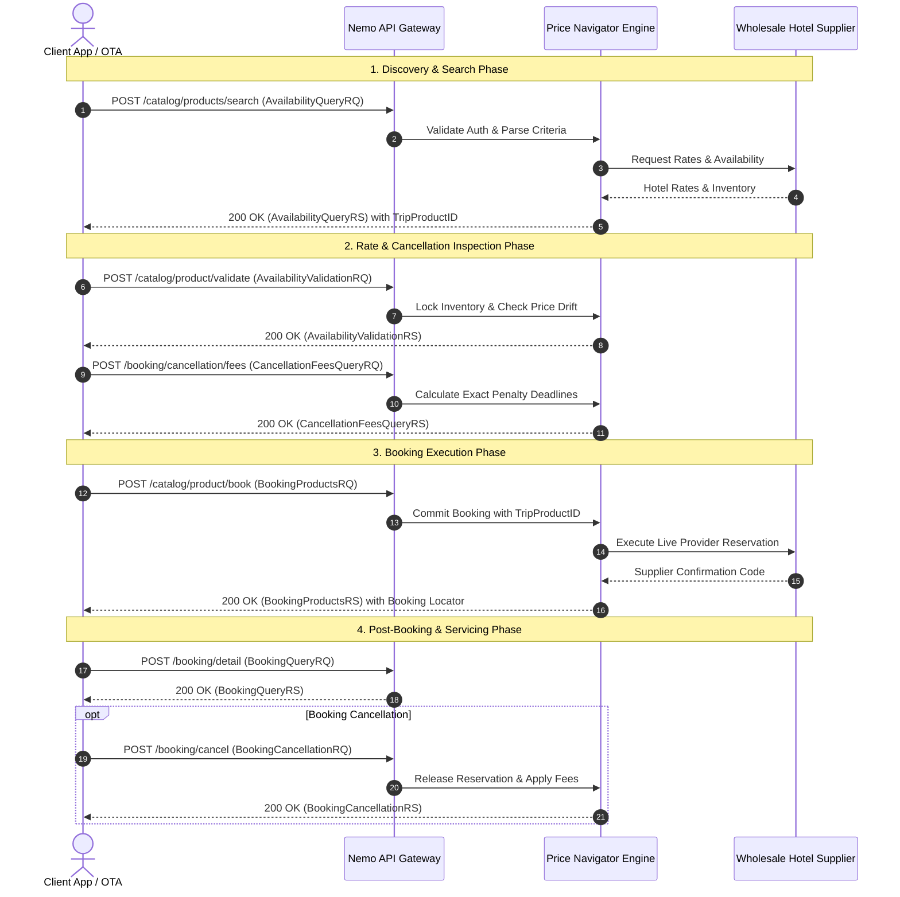

# Nemo Group (Price Navigator) Hotel Web Services Specification

## 1. Executive & Technical Overview

The **Nemo Group Price Navigator Hotel Web Service** is an enterprise-grade distribution and reservation platform designed to connect travel management companies, online travel agencies (OTAs), and tour operators to wholesale hotel inventories. 

The service operates on a **REST/XML over HTTPS** architectural paradigm. All transactional payloads are transmitted via **HTTPS POST** requests carrying structured XML bodies conforming to the Price Navigator XML schema.

### Core Architectural Characteristics
- **Transport**: HTTPS (TLS 1.2 / TLS 1.3 mandatory).
- **Format**: XML payload in both Request (`*RQ`) and Response (`*RS`).
- **HTTP Method**: Exclusively `POST` across all transactional and inquiry endpoints.
- **State Model**: Chained transactional workflow orchestrated via unique identifier tokens (`TripProductID` and `TransactionId`).
- **Idempotency**: Requests must carry a client-generated `TransactionId` to safeguard against duplicate executions and enable asynchronous query tracking.

---

## 2. Environments & Service Endpoints

The Price Navigator platform maintains isolated staging and production infrastructures. All transactions must be targeted according to the environment designation:

| Environment | Base URL | Purpose |
| :--- | :--- | :--- |
| **Certification / Test** | `https://service-cert.psurfer.net/pricesurfer/` | Development, end-to-end integration testing, QA verification, and certification validation. |
| **Production** | `https://service.psurfer.net/pricesurfer/` | Live transactional processing, inventory consumption, and active financial bookings. |

---

## 3. Transport Security, Authentication & HTTP Headers

Every HTTP request dispatched to the Price Navigator engine must be accompanied by mandatory transport-level headers. Failure to present valid headers results in immediate rejection at the API gateway or transport boundary.

### Required HTTP Headers

```http
POST /pricesurfer/catalog/products/search HTTP/1.1
Host: service.psurfer.net
Accept: application/xml
Content-Type: application/xml
X-PS-AUTHTOKEN: 9a8b7c6d-5e4f-3a2b-1c0d-9e8f7a6b5c4d
Accept-Encoding: gzip,deflate
Content-Length: 2184
Connection: keep-alive
```

### Header Definitions

| Header | Value / Type | Requirement | Description |
| :--- | :--- | :--- | :--- |
| `Accept` | `application/xml` | **Mandatory** | Instructs the server to serialize output in XML format. |
| `Content-Type` | `application/xml` | **Mandatory** | Specifies that the incoming HTTP body contains valid XML. |
| `X-PS-AUTHTOKEN` | `string` (UUID / Alphanumeric) | **Mandatory** | Security token assigned per client/organization for authentication and tenant isolation. |
| `Accept-Encoding` | `gzip,deflate` | **Mandatory** | Enables compression. Highly recommended to reduce payload sizes on large catalog searches. |

---

## 4. End-to-End Operations Lifecycle

The Nemo Group Hotel Web Services lifecycle strictly enforces a sequential progression from initial search to confirmed reservation. 



### Complete Endpoint Registry

| URI Path | Request Payload (`*RQ`) | Response Payload (`*RS`) | Description & Operational Role |
| :--- | :--- | :--- | :--- |
| `/catalog/products/search` | `AvailabilityQueryRQ` | `AvailabilityQueryRS` | **Hotel Search**: Queries live hotel availability, rates, and room types for given destination, dates, and occupancies. |
| `/catalog/product/validate` | `AvailabilityValidationRQ` | `AvailabilityValidationRS` | **Rate Validation**: Validates the selected `TripProductID` against real-time provider inventory to confirm price stability prior to checkout. |
| `/booking/cancellation/fees` | `CancellationFeesQueryRQ` | `CancellationFeesQueryRS` | **Cancellation Fees**: Retrieves exact cancellation penalty policies, deadline timestamps, and monetary fees for the rate. |
| `/catalog/product/book` | `BookingProductsRQ` | `BookingProductsRS` | **Booking Creation**: Commits the reservation for the validated product, submitting guest details and room assignments. |
| `/booking/detail` | `BookingQueryRQ` | `BookingQueryRS` | **Booking Retrieval**: Retrieves full details, status, room breakdowns, and vouchers for an existing booking locator. |
| `/booking/cancel` | `BookingCancellationRQ` | `BookingCancellationRS` | **Booking Cancellation**: Cancels an active reservation, applying penalty rules according to agreed cancellation deadlines. |
| `/catalog/product/detail` | `AdditionalInfoQueryRQ` | `AdditionalInfoQueryRS` | **Product Details**: Retrieves extended content, high-resolution media, descriptions, and hotel facilities. |
| `/catalog/hotels/list` | `HotelCatalogQueryRQ` | `HotelCatalogQueryRS` | **Hotel Master Catalog**: Dumps or filters static hotel metadata (destination IDs, addresses, coordinates, and star ratings). |

---

## 5. Hotel Search (`/catalog/products/search`) Specification

### 5.1 Input Specification (`AvailabilityQueryRQ`)

The root element is `<AvailabilityQueryRQ>`, containing global transaction parameters, passenger definitions, trip criteria, and pagination settings.

#### Element and Attribute Hierarchy

- **Root Element**: `<AvailabilityQueryRQ>`
  - `@TransactionId` *(string, mandatory)*: Unique alphanumeric identifier (supporting underscores) generated by the client (`^[a-zA-Z0-9_]{8,64}$`).
  - `@TransactionMode` *(enum, mandatory)*: Operational mode:
    - `Synchronous`: Waits for all suppliers to reply within the timeout threshold.
    - `StartAsync`: Initiates an asynchronous query and returns an execution token.
    - `ContinueAsync`: Polls for partial or completed results using an async execution token.
- **`<GeneralParameters>`**:
  - `<PreferedLanguage>`: 2-character ISO 639-1 language code (e.g., `es`, `en`, `pt`).
  - `<PreferedCurrency>`: 3-character ISO 4217 currency code (e.g., `EUR`, `USD`, `GBP`).
- **`<Trips>` / `<Trip>`**:
  - `<Destination>` *(numeric string, mandatory)*: Unique destination identifier in the Nemo system (e.g., `2262` representing Madrid).
- **`<HotelsParameters>` / `<Criterion>`**:
  - `<Rooms>`: Container for room configuration.
    - `<Room>`:
      - `@RoomType`: Canonical Nemo room classification (e.g., `NMO.HTL.RMT.SGL` for Single, `NMO.HTL.RMT.DBL` for Double, `NMO.HTL.RMT.TPL` for Triple).
      - `@RoomSequence`: 1-indexed room sequence number mapping room index to passenger assignments.
  - `<CheckIn>`: Check-in date formatted as `YYYY-MM-DD`.
  - `<CheckOut>`: Check-out date formatted as `YYYY-MM-DD`.
  - `<Availability>`: Filtering flag, typically `CNF` (Confirmed/Instant booking only).
  - `<HotelName>` *(optional)*: Textual search filter to restrict matches by hotel name substring.
  - `<HotelCodeList>` *(optional)*: Comma-separated list of explicit hotel codes to target.
  - `<Ratings>`: Comma-separated list of star rating filters (e.g., `3,4,5`).
- **`<Passengers>`**:
  - `<Passenger>`:
    - `@AgeType`: Canonical Nemo passenger type:
      - `NMO.GBL.AGT.ADT`: Adult.
      - `NMO.GBL.AGT.CHD`: Child (requires `@Age`).
      - `NMO.GBL.AGT.INF`: Infant (requires `@Age`).
    - `@Age` *(numeric, conditional)*: Age of the passenger. Mandatory if `@AgeType` is `CHD` or `INF`.
    - `@RoomSequence`: Identifies which room this passenger is assigned to (corresponds to `<Room @RoomSequence="...">`).
- **`<RequestSet>`**:
  - `<FirstItem>` *(numeric, mandatory)*: 1-indexed record offset for pagination.
  - `<ItemsPerPage>` *(numeric, mandatory)*: Number of hotels returned per response page (e.g., `20`).

---

### 5.2 Concrete XML Request Example (`AvailabilityQueryRQ`)

```xml
<?xml version="1.0" encoding="UTF-8"?>
<AvailabilityQueryRQ TransactionId="TX_SEARCH_20260902_987654321" TransactionMode="Synchronous">
  <GeneralParameters>
    <PreferedLanguage>es</PreferedLanguage>
    <PreferedCurrency>EUR</PreferedCurrency>
  </GeneralParameters>
  <Trips>
    <Trip>
      <Destination>2262</Destination>
    </Trip>
  </Trips>
  <HotelsParameters>
    <Criterion>
      <Rooms>
        <Room RoomType="NMO.HTL.RMT.DBL" RoomSequence="1" />
      </Rooms>
      <CheckIn>2026-11-15</CheckIn>
      <CheckOut>2026-11-20</CheckOut>
      <Availability>CNF</Availability>
      <HotelName>Grand Palace</HotelName>
      <HotelCodeList>MAD00123,MAD00456,MAD00789</HotelCodeList>
      <Ratings>4,5</Ratings>
    </Criterion>
  </HotelsParameters>
  <Passengers>
    <Passenger AgeType="NMO.GBL.AGT.ADT" RoomSequence="1" />
    <Passenger AgeType="NMO.GBL.AGT.ADT" RoomSequence="1" />
    <Passenger AgeType="NMO.GBL.AGT.CHD" Age="8" RoomSequence="1" />
  </Passengers>
  <RequestSet>
    <FirstItem>1</FirstItem>
    <ItemsPerPage>10</ItemsPerPage>
  </RequestSet>
</AvailabilityQueryRQ>
```

---

### 5.3 Output Specification (`AvailabilityQueryRS`)

The root element is `<AvailabilityQueryRS>`. It returns search metadata, pagination information, and a list of hotels with their associated rates and policies.

#### Key Nodes and Fields
- **`<AvailabilityQueryRS>`**:
  - `@TransactionId`: Matches the inbound request's `TransactionId`.
  - `@Status`: Result status (`Success`, `Warning`, or `Error`).
  - `@ExecutionTime`: Milliseconds elapsed during server-side aggregation.
- **`<Pagination>`**:
  - `<TotalItems>`: Total count of matching hotels across all pages.
  - `<FirstItem>`: Current offset.
  - `<ItemsPerPage>`: Current batch limit.
- **`<Hotels>`**: Container of matched hotel properties.
  - `<Hotel>`:
    - `<HotelCode>`: Unique master identifier of the hotel property.
    - `<HotelName>`: Commercial hotel name.
    - `<HotelRating>`: Numerical star rating (`1` to `5`).
    - `<Address>`: Structured location data (`Street`, `City`, `PostalCode`, `CountryCode`).
    - `<Position>`: Geospatial coordinates (`Latitude`, `Longitude`).
    - `<Rates>`: Container of available rate offerings.
      - `<Rate>`:
        - `<TripProductID>`: Critical encrypted session identifier required for subsequent operations (validation, cancellation fee queries, and booking).
        - `<RateClass>`: Fare category (e.g., `Standard`, `NonRefundable`, `Corporate`).
        - `<Price Amount="..." Currency="..." />`: Total gross price for the entire stay.
        - `<RoomRates>`: Breakdown per room sequence.
          - `<RoomRate RoomSequence="...">`:
            - `<RoomType>`: Specific provider room label (e.g., `Deluxe Double Room with Balcony`).
            - `<BoardType Code="..." Description="..." />`: Meal plan (e.g., `RO` for Room Only, `BB` for Bed & Breakfast, `HB` for Half Board, `AI` for All Inclusive).
        - `<CancellationPolicy>`:
          - `<Refundable>`: Boolean flag (`true` / `false`).
          - `<Deadline>`: UTC timestamp (`YYYY-MM-DDTHH:mm:ssZ`) before which cancellation is free of charge.
          - `<Penalties>`: Tiered fee penalties when canceled after the deadline.

---

### 5.4 Concrete XML Response Example (`AvailabilityQueryRS`)

```xml
<?xml version="1.0" encoding="UTF-8"?>
<AvailabilityQueryRS TransactionId="TX_SEARCH_20260902_987654321" Status="Success" ExecutionTime="842ms">
  <Pagination>
    <TotalItems>42</TotalItems>
    <FirstItem>1</FirstItem>
    <ItemsPerPage>10</ItemsPerPage>
  </Pagination>
  <Hotels>
    <Hotel>
      <HotelCode>MAD00123</HotelCode>
      <HotelName>Grand Palace Hotel &amp; Spa</HotelName>
      <HotelRating>5</HotelRating>
      <Address>
        <Street>Paseo de la Castellana 120</Street>
        <City>Madrid</City>
        <PostalCode>28046</PostalCode>
        <CountryCode>ES</CountryCode>
      </Address>
      <Position>
        <Latitude>40.443912</Latitude>
        <Longitude>-3.690831</Longitude>
      </Position>
      <Rates>
        <Rate>
          <TripProductID>NMO-PRD-20260902-882194-A91C3E</TripProductID>
          <RateClass>Standard</RateClass>
          <Price Amount="850.00" Currency="EUR" />
          <RoomRates>
            <RoomRate RoomSequence="1">
              <RoomType>Deluxe Double Room with Balcony</RoomType>
              <BoardType Code="NMO.HTL.BRD.BB" Description="Bed &amp; Breakfast" />
            </RoomRate>
          </RoomRates>
          <CancellationPolicy>
            <Refundable>true</Refundable>
            <Deadline>2026-11-10T23:59:59Z</Deadline>
            <Penalties>
              <Penalty From="2026-11-11T00:00:00Z" To="2026-11-13T23:59:59Z" Amount="170.00" Currency="EUR" />
              <Penalty From="2026-11-14T00:00:00Z" To="2026-11-15T12:00:00Z" Amount="425.00" Currency="EUR" />
              <Penalty From="2026-11-15T12:00:01Z" Amount="850.00" Currency="EUR" />
            </Penalties>
          </CancellationPolicy>
        </Rate>
        <Rate>
          <TripProductID>NMO-PRD-20260902-882195-B72D4F</TripProductID>
          <RateClass>NonRefundable</RateClass>
          <Price Amount="722.50" Currency="EUR" />
          <RoomRates>
            <RoomRate RoomSequence="1">
              <RoomType>Deluxe Double Room with Balcony</RoomType>
              <BoardType Code="NMO.HTL.BRD.BB" Description="Bed &amp; Breakfast" />
            </RoomRate>
          </RoomRates>
          <CancellationPolicy>
            <Refundable>false</Refundable>
            <Deadline>2026-09-02T10:50:00Z</Deadline>
            <Penalties>
              <Penalty From="2026-09-02T10:50:00Z" Amount="722.50" Currency="EUR" />
            </Penalties>
          </CancellationPolicy>
        </Rate>
      </Rates>
    </Hotel>
  </Hotels>
</AvailabilityQueryRS>
```

---

## 6. Detailed Specifications for Downstream Lifecycle Operations

### 6.1 Rate Validation (`/catalog/product/validate`)

Before presenting final payment terms or committing an order, clients **must** invoke `/catalog/product/validate`. This operation verifies rate stability, room availability, and whether price drift occurred since the initial search.

#### Validation Request (`AvailabilityValidationRQ`)

```xml
<?xml version="1.0" encoding="UTF-8"?>
<AvailabilityValidationRQ TransactionId="TX_VAL_20260902_1001" TransactionMode="Synchronous">
  <TripProductID>NMO-PRD-20260902-882194-A91C3E</TripProductID>
</AvailabilityValidationRQ>
```

#### Validation Response (`AvailabilityValidationRS`)

```xml
<?xml version="1.0" encoding="UTF-8"?>
<AvailabilityValidationRS TransactionId="TX_VAL_20260902_1001" Status="Success">
  <TripProductID>NMO-PRD-20260902-882194-A91C3E</TripProductID>
  <ValidatedPrice Amount="850.00" Currency="EUR" PriceChanged="false" />
  <AvailabilityStatus>Confirmed</AvailabilityStatus>
  <RateStatus>Available</RateStatus>
</AvailabilityValidationRS>
```

> [!NOTE]
> If a price adjustment occurred upstream, `PriceChanged` will be set to `true` and the updated amount will appear in `ValidatedPrice`. If the rate has been withdrawn, error `5000` or `1101` is returned.

---

### 6.2 Cancellation Fees (`/booking/cancellation/fees`)

Retrieves the definitive cancellation penalty schedule immediately prior to booking commitment.

#### Cancellation Fees Request (`CancellationFeesQueryRQ`)

```xml
<?xml version="1.0" encoding="UTF-8"?>
<CancellationFeesQueryRQ TransactionId="TX_FEES_20260902_1002" TransactionMode="Synchronous">
  <TripProductID>NMO-PRD-20260902-882194-A91C3E</TripProductID>
</CancellationFeesQueryRQ>
```

#### Cancellation Fees Response (`CancellationFeesQueryRS`)

```xml
<?xml version="1.0" encoding="UTF-8"?>
<CancellationFeesQueryRS TransactionId="TX_FEES_20260902_1002" Status="Success">
  <TripProductID>NMO-PRD-20260902-882194-A91C3E</TripProductID>
  <Currency>EUR</Currency>
  <FreeCancellationDeadline>2026-11-10T23:59:59Z</FreeCancellationDeadline>
  <FeeSchedule>
    <Tier StartDate="2026-11-11T00:00:00Z" EndDate="2026-11-13T23:59:59Z" FeeAmount="170.00" PenaltyPercentage="20.00" />
    <Tier StartDate="2026-11-14T00:00:00Z" EndDate="2026-11-15T12:00:00Z" FeeAmount="425.00" PenaltyPercentage="50.00" />
    <Tier StartDate="2026-11-15T12:00:01Z" FeeAmount="850.00" PenaltyPercentage="100.00" />
  </FeeSchedule>
</CancellationFeesQueryRS>
```

---

### 6.3 Booking Creation (`/catalog/product/book`)

Commits the hotel reservation against the underlying wholesale supplier. This operation permanently consumes the `TripProductID` and returns a confirmed booking locator.

#### Booking Request (`BookingProductsRQ`)

```xml
<?xml version="1.0" encoding="UTF-8"?>
<BookingProductsRQ TransactionId="TX_BOOK_20260902_1003" TransactionMode="Synchronous">
  <TripProductID>NMO-PRD-20260902-882194-A91C3E</TripProductID>
  <ClientReference>BOOK-CLT-778899</ClientReference>
  <LeadPassenger Title="MR" FirstName="Carlos" LastName="Mendez" Email="carlos.mendez@example.com" Phone="+34611223344" />
  <Rooms>
    <Room RoomSequence="1">
      <Guests>
        <Guest Title="MR" FirstName="Carlos" LastName="Mendez" Type="ADT" />
        <Guest Title="MRS" FirstName="Lucia" LastName="Gomez" Type="ADT" />
        <Guest Title="CHD" FirstName="Mateo" LastName="Mendez" Type="CHD" Age="8" />
      </Guests>
      <SpecialRequests>Quiet room on higher floor, if available.</SpecialRequests>
    </Room>
  </Rooms>
  <PaymentDetails Method="CreditLimit" />
</BookingProductsRQ>
```

#### Booking Response (`BookingProductsRS`)

```xml
<?xml version="1.0" encoding="UTF-8"?>
<BookingProductsRS TransactionId="TX_BOOK_20260902_1003" Status="Success">
  <BookingLocator>NMO-BK-9920141</BookingLocator>
  <SupplierConfirmationCode>HTL-CONF-883910</SupplierConfirmationCode>
  <ClientReference>BOOK-CLT-778899</ClientReference>
  <CreationDate>2026-09-02T10:55:00Z</CreationDate>
  <BookingStatus>Confirmed</BookingStatus>
  <TotalPrice Amount="850.00" Currency="EUR" />
  <HotelInformation>
    <HotelCode>MAD00123</HotelCode>
    <HotelName>Grand Palace Hotel &amp; Spa</HotelName>
    <CheckIn>2026-11-15</CheckIn>
    <CheckOut>2026-11-20</CheckOut>
  </HotelInformation>
</BookingProductsRS>
```

---

### 6.4 Booking Detail Query (`/booking/detail`)

Queries the current status, room allocations, guest roster, and voucher documentation of an existing booking locator.

#### Booking Detail Request (`BookingQueryRQ`)

```xml
<?xml version="1.0" encoding="UTF-8"?>
<BookingQueryRQ TransactionId="TX_QRY_20260902_1004">
  <BookingLocator>NMO-BK-9920141</BookingLocator>
</BookingQueryRQ>
```

#### Booking Detail Response (`BookingQueryRS`)

```xml
<?xml version="1.0" encoding="UTF-8"?>
<BookingQueryRS TransactionId="TX_QRY_20260902_1004" Status="Success">
  <BookingLocator>NMO-BK-9920141</BookingLocator>
  <SupplierConfirmationCode>HTL-CONF-883910</SupplierConfirmationCode>
  <ClientReference>BOOK-CLT-778899</ClientReference>
  <BookingStatus>Confirmed</BookingStatus>
  <TotalPrice Amount="850.00" Currency="EUR" />
  <CancellationDeadline>2026-11-10T23:59:59Z</CancellationDeadline>
  <VoucherUrl>https://service.psurfer.net/pricesurfer/vouchers/NMO-BK-9920141.pdf</VoucherUrl>
</BookingQueryRS>
```

---

### 6.5 Booking Cancellation (`/booking/cancel`)

Cancels an active booking locator and applies cancellation penalty policies based on current time versus agreed deadlines.

#### Cancellation Request (`BookingCancellationRQ`)

```xml
<?xml version="1.0" encoding="UTF-8"?>
<BookingCancellationRQ TransactionId="TX_CNC_20260902_1005">
  <BookingLocator>NMO-BK-9920141</BookingLocator>
  <Reason>Client itinerary rescheduled</Reason>
</BookingCancellationRQ>
```

#### Cancellation Response (`BookingCancellationRS`)

```xml
<?xml version="1.0" encoding="UTF-8"?>
<BookingCancellationRS TransactionId="TX_CNC_20260902_1005" Status="Success">
  <BookingLocator>NMO-BK-9920141</BookingLocator>
  <CancellationStatus>Cancelled</CancellationStatus>
  <CancellationReference>NMO-CNC-441029</CancellationReference>
  <PenaltyFee Amount="0.00" Currency="EUR" />
  <RefundAmount Amount="850.00" Currency="EUR" />
</BookingCancellationRS>
```

---

### 6.6 Product Additional Details (`/catalog/product/detail`)

Retrieves rich static content such as hotel facility lists, room dimensions, high-resolution photo galleries, and check-in/out policies.

#### Additional Info Request (`AdditionalInfoQueryRQ`)

```xml
<?xml version="1.0" encoding="UTF-8"?>
<AdditionalInfoQueryRQ TransactionId="TX_INFO_20260902_1006">
  <HotelCode>MAD00123</HotelCode>
  <LanguageCode>es</LanguageCode>
</AdditionalInfoQueryRQ>
```

#### Additional Info Response (`AdditionalInfoQueryRS`)

```xml
<?xml version="1.0" encoding="UTF-8"?>
<AdditionalInfoQueryRS TransactionId="TX_INFO_20260902_1006" Status="Success">
  <HotelCode>MAD00123</HotelCode>
  <Description>El Grand Palace Hotel &amp; Spa ofrece un alojamiento de lujo en el distrito financiero de Madrid con spa completo y restaurante de alta cocina.</Description>
  <CheckInTime>15:00</CheckInTime>
  <CheckOutTime>12:00</CheckOutTime>
  <Amenities>
    <Amenity Code="SPA">Spa &amp; Wellness Centre</Amenity>
    <Amenity Code="WIFI">Free High-Speed Wi-Fi</Amenity>
    <Amenity Code="POOL">Heated Indoor Swimming Pool</Amenity>
    <Amenity Code="PARK">Private Valet Parking</Amenity>
  </Amenities>
  <Images>
    <Image Category="Exterior" Url="https://cdn.psurfer.net/hotels/MAD00123/exterior_01.jpg" />
    <Image Category="Room" Url="https://cdn.psurfer.net/hotels/MAD00123/deluxe_01.jpg" />
  </Images>
</AdditionalInfoQueryRS>
```

---

### 6.7 Hotel Catalog List (`/catalog/hotels/list`)

Extracts static hotel inventory catalog for a destination to support destination mapping, search caching, and property index synchronization.

#### Catalog Query Request (`HotelCatalogQueryRQ`)

```xml
<?xml version="1.0" encoding="UTF-8"?>
<HotelCatalogQueryRQ TransactionId="TX_CAT_20260902_1007">
  <DestinationCode>2262</DestinationCode>
  <ActiveOnly>true</ActiveOnly>
</HotelCatalogQueryRQ>
```

#### Catalog Query Response (`HotelCatalogQueryRS`)

```xml
<?xml version="1.0" encoding="UTF-8"?>
<HotelCatalogQueryRS TransactionId="TX_CAT_20260902_1007" Status="Success">
  <DestinationCode>2262</DestinationCode>
  <DestinationName>Madrid</DestinationName>
  <HotelCount>1</HotelCount>
  <Hotels>
    <HotelSummary HotelCode="MAD00123" HotelName="Grand Palace Hotel &amp; Spa" Rating="5" Latitude="40.443912" Longitude="-3.690831" City="Madrid" Country="ES" />
  </Hotels>
</HotelCatalogQueryRS>
```

---

## 7. Error Codes Reference Table & Recovery Strategies

When a transaction cannot be fulfilled, the service returns an XML response containing an `<ErrorRS>` envelope with specific error codes.

```xml
<?xml version="1.0" encoding="UTF-8"?>
<ErrorRS TransactionId="TX_FAIL_20260902_001" Status="Error">
  <Error Code="5011" Message="TripProductId expired" Type="BusinessException">
    <Details>The product session NMO-PRD-20260902-882194-A91C3E has exceeded the 30 minute TTL.</Details>
  </Error>
</ErrorRS>
```

### Comprehensive Error Code Matrix

| Error Code | Official Description | Root Cause | Impact | Recommended Handling / Recovery Strategy |
| :---: | :--- | :--- | :--- | :--- |
| **401** | Unauthorized token | Missing, malformed, or expired `X-PS-AUTHTOKEN`. | Request denied immediately. | Validate token configuration in secret manager; renew credentials with Nemo account management. |
| **1000** | Unexpected error | Unhandled internal exception within Price Navigator backend. | Transaction aborted. | Log transaction ID; retry once after 500ms backoff; alert on-call engineer if persistent. |
| **1015** | No credit | Agency credit limit or deposit balance has been exhausted. | Booking or validation blocked. | Alert finance/operations team immediately; switch booking route or top up credit account. |
| **1101** | TripProductId not available | Inventory was booked by another buyer or removed by supplier. | Product cannot be validated or booked. | Prompt user to refresh search results to view fresh available inventory. |
| **1103** | Rejected by cancellation charges | Wholesaler rejected cancellation due to non-refundable clause. | Cancellation aborted. | Manual escalation to Nemo support operations with booking locator. |
| **1104** | Cannot check cancellation charges | Downstream supplier timeout while retrieving fee schedule. | Fee query failed. | Retry `/booking/cancellation/fees` once; if fails, fall back to search-time policy. |
| **1105** | Rejected by deadline | Booking request received after wholesaler cut-off deadline. | Booking rejected. | Check-in is too imminent; initiate new search with flexible dates or alternative hotels. |
| **1106** | Price changed | Wholesaler updated rate between search and validation. | Price drift detected. | Extract new price from response; display price increase/decrease to customer for approval. |
| **1107** | Cache expired | Downstream supplier cache entry expired. | Query failed. | Re-execute search query synchronously against suppliers. |
| **1108** | Connectivity error | Timeout or network partition between Price Navigator and wholesaler. | Transient connection failure. | Implement exponential backoff retry (up to 2 retries with jitter). |
| **1109** | Unable to query booking | Upstream booking database unavailable or locator invalid. | Booking detail lookup failed. | Verify booking locator format; retry after 2 seconds. |
| **3000** | Request detail for booking | Required guest information or document details missing. | Validation/booking rejected. | Ensure all passengers have valid names, birthdates, and assigned rooms in payload. |
| **5000** | No availability | No rooms match the requested destination, dates, or occupancy. | Empty search result. | Expand search criteria, remove star rating filter, or alter dates. |
| **5010** | TripProductId not found | Identifier is synthetic, corrupted, or belongs to another environment. | Transaction invalid. | Verify `TripProductID` integrity and ensure client is not mixing Cert and Prod IDs. |
| **5011** | TripProductId expired | The 30-minute state TTL on the `TripProductID` has elapsed. | Session invalid. | Instruct frontend application to trigger a fresh `/catalog/products/search`. |
| **5012** | Search results expired | Asynchronous query polling expired before results were consumed. | Async query closed. | Re-initiate `AvailabilityQueryRQ` with `TransactionMode="StartAsync"`. |
| **5020** | Product invalid | Product configuration has been deactivated in the hotel catalog. | Product unusable. | Exclude hotel from active suggestions; refresh catalog mappings. |
| **5100** | Invalid request document | XML payload does not conform to the XML Schema (XSD) definition. | Bad Request (400). | Validate outgoing XML against local XSD schemas; verify tag casing and required attributes. |
| **5120** | Not available when booking | Last room sold out between validation and final book call. | Booking commitment failed. | Roll back client transaction; do not charge customer card; present alternative rooms. |

---

## 8. Operational Rules & Business Constraints

### 8.1 30-Minute Cache & Session TTL
- Every `TripProductID` returned in `AvailabilityQueryRS` is bound to a strict **30-minute Time-To-Live (TTL)**.
- If more than 30 minutes elapse between the user viewing the search result and submitting the booking, the gateway will reject the transaction with error `5011` (`TripProductId expired`).
- Client architectures must implement client-side expiration timers (recommended 25-minute UX warning) prompting the user to refresh their selection before payment submission.

### 8.2 Strict Rate Limiting (10 req / 10 sec)
- The Price Navigator gateway enforces a strict rate limit of **maximum 10 requests per 10 seconds** per `X-PS-AUTHTOKEN`.
- Exceeding this threshold triggers an immediate HTTP `429 Too Many Requests` or transport-level TCP disconnection.
- **Client Implementation Requirement**: All client outbound traffic must pass through a local token-bucket or sliding-window rate-limiter queue configured to a conservative **8 requests per 10 seconds** to accommodate network jitter.

### 8.3 Chained Product Identifier Workflow
The `TripProductID` operates as an immutable state token:
1. **Generated**: Emitted in `/catalog/products/search`.
2. **Locked / Verified**: Passed to `/catalog/product/validate`. If a price change occurs, a new `TripProductID` may be returned in the response which must supersede the previous ID.
3. **Priced**: Passed to `/booking/cancellation/fees` to verify legal cancellation penalties.
4. **Consumed**: Passed to `/catalog/product/book`. Once successfully booked, the `TripProductID` transitions to consumed and cannot be reused. Any subsequent booking attempt using the same ID will result in `5020` or `5010`.
