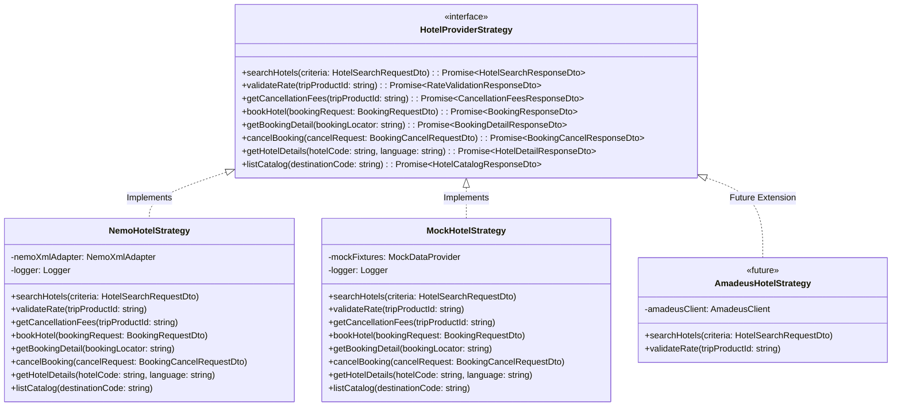
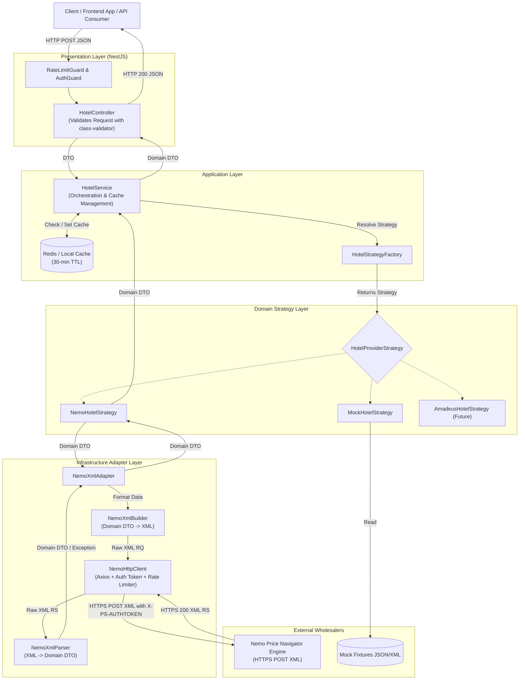
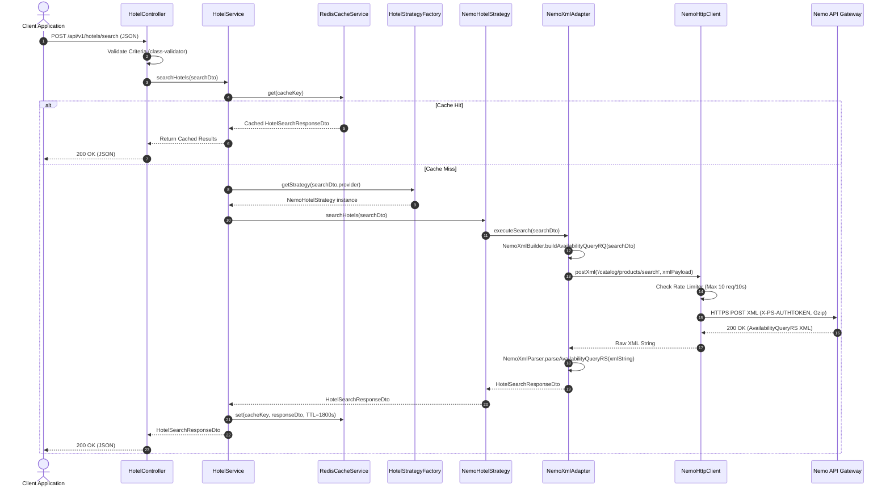
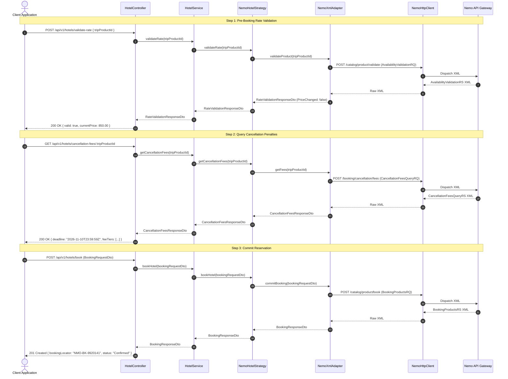

# System Architecture Specification: Hotel Provider Service

## 1. Executive Summary for Leadership

The **Hotel Provider Service** is an enterprise-grade backend service architected to standardize, decouple, and orchestrate hotel inventory distribution across heterogeneous upstream travel wholesalers.

### Business Value & Strategic Architecture Drivers
- **Vendor-Agnostic Core**: The core reservation and search orchestration logic is completely isolated from the idiosyncrasies of external suppliers. Integrating new suppliers (e.g., Amadeus, Hotelbeds, Sabre) or transitioning away from existing ones requires zero modifications to upstream booking engines or consumer client applications.
- **Layered Architecture & Separation of Concerns**: Responsibilities are strictly partitioned across presentation (Controllers), application orchestration (Services), provider abstraction (Strategies), and wire-protocol translation (Adapters). This guarantees that protocol changes (such as XML schema updates) are contained exclusively within adapter boundaries.
- **Operational Transparency**: Every system capability is exposed via strongly-typed TypeScript contracts, OpenAPI/Swagger specifications, unified JSON error envelopes, and distributed health checks. Engineers and stakeholders can immediately discern which operations are supported, how they behave, and their operational telemetry.
- **Zero-Cost Offline Development**: A built-in Mock strategy allows frontend engineers, QA teams, and CI/CD pipelines to run full booking workflows offline without burning supplier rate limits, consuming test credits, or requiring live credentials.

---

## 2. Technology Selection: Why NestJS?

The service is built on **NestJS** (Node.js / TypeScript). NestJS was selected over lightweight alternatives (such as Express or Fastify alone) due to key enterprise architecture capabilities:

```
┌───────────────────────────────────────────────────────────────────┐
│                           NestJS Core                             │
├─────────────────┬─────────────────┬───────────────────────────────┤
│  Native IoC/DI  │ Modular Domain  │    Future-Proof Worker Ready  │
│    Container    │   Boundaries    │ (BullMQ / Microservices / CLI)│
└────────┬────────┴────────┬────────┴───────────────┬───────────────┘
         │                 │                        │
         ▼                 ▼                        ▼
 Clean Strategy     Isolated Adapters     Shared Business Logic in
  Decoupling        & Wire Protocols      Standalone Async Daemons
```

### 2.1 Native Inversion of Control (IoC) and Dependency Injection (DI)
- In travel distribution, switching between providers, swapping transport mechanisms, and injecting mock fixtures during unit testing are first-class requirements.
- NestJS provides an enterprise-grade IoC container that allows interface-based dependency injection. Concrete strategy implementations (`NemoHotelStrategy`, `MockHotelStrategy`) and adapters (`NemoXmlAdapter`) can be swapped at runtime or configuration time via injection tokens with zero coupling.

### 2.2 Modular Separation of Concerns
- The framework enforces strict modular encapsulation (`HotelModule`, `NemoModule`, `CommonModule`).
- Controllers only coordinate HTTP transport and validation; application services only orchestrate domain flows; strategies encapsulate supplier-specific workflows; and adapters handle low-level serialization and protocol mapping.

### 2.3 Future-Proof Worker & Microservices Readiness
Travel platforms frequently evolve beyond basic synchronous HTTP REST APIs. NestJS provides architectural readiness for upcoming infrastructure stages without requiring system redesigns:
- **Standalone Application Contexts (`NestFactory.createApplicationContext`)**: Background daemon workers, cron jobs, and CLI scripts can instantiate the exact same service, strategy, and adapter classes without launching an HTTP listener.
- **BullMQ / Redis Job Queues**: Background hotel search caching, asynchronous supplier polling (`StartAsync` / `ContinueAsync`), and price drift trackers can be moved to dedicated queue consumers using the native `@nestjs/bullmq` integration.
- **Microservice Transport Layer**: If the service needs to transition to a high-throughput gRPC or NATS microservice mesh, NestJS supports transport changes via decorators without changing any internal domain logic.

### 2.4 End-to-End Type Safety & Data Validation
- Native integration with `class-validator` and `class-transformer` guarantees that all incoming payloads are strictly validated before hitting business logic.
- Strongly-typed domain models eliminate runtime type coercion issues when translating between XML attributes and JSON payloads.

---

## 3. The Strategy Pattern Architecture

### 3.1 Purpose
The **Strategy Pattern** abstracts hotel provider interactions behind a unified domain contract. Business services never interact directly with supplier APIs or supplier-specific parameters. Instead, they interact with the `HotelProviderStrategy` interface.



### 3.2 Strategy Implementations

1. **`NemoHotelStrategy`**:
   - Executes live requests against the Nemo Group Price Navigator platform.
   - Delegates XML serialization and deserialization to the `NemoXmlAdapter`.
   - Maps Nemo error codes (e.g., `5011`, `1106`, `5000`) to domain-specific business exceptions.
   - Handles supplier session tracking and `TripProductID` lifecycle management.

2. **`MockHotelStrategy`**:
   - Fully air-gapped strategy that returns realistic test fixture data without network calls.
   - Enables fast, zero-latency automated unit/e2e testing and offline frontend development.
   - Supports deterministic edge-case simulation via synthetic IDs (e.g., passing `MOCK-EXP-001` triggers an expired product exception; passing `MOCK-PRICE-002` simulates a price change).

3. **Future Extensibility (`AmadeusHotelStrategy`, `HotelbedsStrategy`, `LocalDatabaseStrategy`)**:
   - New suppliers can be implemented by adding a new class satisfying `HotelProviderStrategy`.
   - The core controller, caching layer, logging, and client contracts remain completely untouched.

### 3.3 Dynamic Strategy Resolution (Factory Pattern)
The `HotelStrategyFactory` dynamically selects the strategy at runtime based on:
- Inbound HTTP header: `x-hotel-provider: NEMO | MOCK | AMADEUS`
- Tenant configuration or environment variables (e.g., `DEFAULT_HOTEL_PROVIDER=NEMO`)
- Fallback routing if a provider is experiencing an outage.

```typescript
@Injectable()
export class HotelStrategyFactory {
  constructor(
    @Inject('NemoHotelStrategy') private readonly nemoStrategy: HotelProviderStrategy,
    @Inject('MockHotelStrategy') private readonly mockStrategy: HotelProviderStrategy,
  ) {}

  public getStrategy(provider?: string): HotelProviderStrategy {
    switch (provider?.toUpperCase()) {
      case 'MOCK':
        return this.mockStrategy;
      case 'NEMO':
      default:
        return this.nemoStrategy;
    }
  }
}
```

---

## 4. The Adapter Pattern Architecture

### 4.1 Purpose
The **Adapter Pattern** bridges the gap between our internal strongly-typed, JSON-friendly domain models and the external proprietary XML/POST protocols required by Nemo Price Navigator.

```
┌─────────────────────────────────┐
│    Domain Model (TypeScript)    │  <-- JSON Request DTOs
└────────────────┬────────────────┘
                 │
                 ▼
┌─────────────────────────────────┐
│        NemoXmlAdapter           │  <-- High-Level Orchestrator
├────────────────┬────────────────┤
│ NemoXmlBuilder │ NemoXmlParser  │  <-- Builder (JS->XML) & Parser (XML->JS)
└────────────────┴────────────────┘
                 │
                 ▼
┌─────────────────────────────────┐
│     NemoHttpClient (Axios)      │  <-- HTTP POST, Headers, Auth, Retry, Limits
└────────────────┬────────────────┘
                 │
                 ▼
┌─────────────────────────────────┐
│  Nemo Price Navigator Gateway   │  <-- External Remote System
└─────────────────────────────────┘
```

### 4.2 Component Responsibilities

#### 1. `NemoXmlBuilder`
- Generates valid, schema-compliant XML request strings from internal domain DTOs.
- Encapsulates Nemo-specific taxonomy mapping (e.g., mapping internal room type `DOUBLE` to `NMO.HTL.RMT.DBL` and adult passenger type to `NMO.GBL.AGT.ADT`).
- Inserts mandatory XML attributes such as `@TransactionId`, `@TransactionMode`, `@RoomSequence`, and `@Age`.

#### 2. `NemoXmlParser`
- Parses incoming XML response documents using a high-performance XML parser (`fast-xml-parser`).
- Detects and intercepts `<ErrorRS>` nodes, throwing strongly-typed NestJS exceptions with Nemo error codes.
- Normalizes XML variations (such as arrays serialized as single objects when returning one item) into uniform TypeScript arrays.
- Maps Nemo status indicators (`Confirmed`, `Cancelled`, `Success`) into domain enums.

#### 3. `NemoXmlAdapter` (The Facade)
- Orchestrates the full round-trip: Domain DTO $\to$ XML Request String $\to$ HTTP Dispatch $\to$ XML Response String $\to$ Domain DTO.
- Ensures that every request is assigned an audited `TransactionId`.

#### 4. `NemoHttpClient` (Transport & Resilience)
- Custom wrapper around Axios / NestJS `HttpService`.
- Automatically injects mandatory transport headers:
  - `Accept: application/xml`
  - `Content-Type: application/xml`
  - `X-PS-AUTHTOKEN: <configured-token>`
  - `Accept-Encoding: gzip,deflate`
- **Rate Limiting Guard**: Enforces the supplier restriction of maximum 10 requests per 10 seconds using an in-memory token-bucket interceptor.
- **Exponential Backoff**: Retries idempotent search calls on transient network anomalies (error `1108` or HTTP 503).

---

## 5. End-to-End Data Flow Architecture

### 5.1 Layered Data Flow Diagram



---

### 5.2 Sequence Diagram: Hotel Search Flow



---

### 5.3 Sequence Diagram: Hotel Booking Flow



---

## 6. Project Folder Structure Breakdown

Below is the complete architectural layout of the `hotel-provider-service`. Every directory, module, interface, and test fixture has a single, well-defined responsibility.

```
hotel-provider-service/
├── .env.example                               # Environment variable templates (API tokens, URLs)
├── .gitignore                                 # Git ignore patterns
├── Dockerfile                                 # Multi-stage production container build
├── README.md                                  # Developer setup, commands, and architecture overview
├── nest-cli.json                              # NestJS CLI configuration
├── package.json                               # Project dependencies and script targets
├── tsconfig.json                              # Root TypeScript compiler configuration
├── tsconfig.build.json                        # Build-specific TypeScript configuration
│
├── config/                                    # Environment & application configuration
│   ├── configuration.ts                       # Typed config loader (reads process.env)
│   ├── configuration.interface.ts             # Strict TypeScript interfaces for app config
│   └── validation.schema.ts                   # Joi / class-validator schema for environment vars
│
├── src/
│   ├── main.ts                                # Application bootstrap entrypoint
│   ├── app.module.ts                          # Root NestJS module importing domain modules
│   │
│   ├── common/                                # Shared cross-cutting concerns
│   │   ├── constants/                         # Global constant tokens and injection symbols
│   │   │   ├── injection-tokens.ts            # STRATEGY_FACTORY, NEMO_STRATEGY tokens
│   │   │   └── provider.constants.ts          # Provider names (NEMO, MOCK, AMADEUS)
│   │   ├── decorators/                        # Custom NestJS parameter and route decorators
│   │   │   └── current-provider.decorator.ts  # Extracts provider override from request headers
│   │   ├── filters/                           # Global exception filters
│   │   │   ├── http-exception.filter.ts       # Unified JSON error response formatter
│   │   │   └── provider-error.filter.ts       # Maps Nemo error codes to HTTP status codes
│   │   ├── guards/                            # Authentication and throttle guards
│   │   │   ├── api-key.guard.ts               # Protects service API endpoints
│   │   │   └── rate-limiter.guard.ts          # Client-side inbound rate limiting
│   │   ├── interceptors/                      # Logging, metrics, and response transformers
│   │   │   ├── logging.interceptor.ts         # Structured latency & request/response logger
│   │   │   └── timeout.interceptor.ts         # Enforces request timeout boundaries
│   │   └── utils/                             # Shared utility helper functions
│   │       ├── date.util.ts                   # Date parsing and formatting (YYYY-MM-DD)
│   │       └── id-generator.util.ts           # Unique TransactionId generator
│   │
│   └── modules/
│       ├── cache/                             # Redis and in-memory caching infrastructure
│       │   ├── cache.module.ts                # CacheModule configuration
│       │   └── cache.service.ts               # Unified get/set/del wrapper with TTL
│       │
│       └── hotel/                             # Core Hotel Domain Module
│           ├── hotel.module.ts                # Declares controllers, providers, strategies
│           ├── hotel.controller.ts            # REST Controller exposing standardized endpoints
│           ├── hotel.service.ts               # Domain orchestrator (caching, logging, delegation)
│           │
│           ├── interfaces/                    # Domain contracts and strategy definitions
│           │   ├── hotel-provider.strategy.ts # HotelProviderStrategy interface
│           │   ├── hotel-search.interface.ts  # Search domain interfaces
│           │   └── hotel-booking.interface.ts # Booking domain interfaces
│           │
│           ├── dto/                           # Data Transfer Objects with validation rules
│           │   ├── requests/
│           │   │   ├── hotel-search-request.dto.ts
│           │   │   ├── rate-validation-request.dto.ts
│           │   │   ├── booking-request.dto.ts
│           │   │   └── booking-cancel-request.dto.ts
│           │   └── responses/
│           │       ├── hotel-search-response.dto.ts
│           │       ├── rate-validation-response.dto.ts
│           │       ├── cancellation-fees-response.dto.ts
│           │       ├── booking-response.dto.ts
│           │       └── hotel-catalog-response.dto.ts
│           │
│           ├── strategies/                    # Concrete Strategy Implementations
│           │   ├── hotel-strategy.factory.ts  # Dynamic runtime strategy resolver
│           │   ├── nemo/
│           │   │   ├── nemo-hotel.strategy.ts # Nemo Group live implementation
│           │   │   └── nemo-error-mapper.ts   # Maps Nemo error codes to domain exceptions
│           │   └── mock/
│           │       ├── mock-hotel.strategy.ts # Offline realistic test fixture provider
│           │       └── mock-data-provider.ts  # In-memory fixture repository and query engine
│           │
│           ├── adapters/                      # External Wire-Protocol Adapters
│           │   └── nemo/
│           │       ├── nemo-adapter.module.ts # Declares adapter components & HttpModule
│           │       ├── nemo-xml.adapter.ts    # High-level adapter orchestrating build & parse
│           │       ├── nemo-xml.builder.ts    # Constructs schema-compliant XML requests
│           │       ├── nemo-xml.parser.ts     # Parses raw XML responses into typed domain DTOs
│           │       └── nemo-http.client.ts    # Axios HTTP client, token injection, rate limiter
│           │
│           └── fixtures/                      # Test and Mock JSON / XML Data Fixtures
│               ├── search-response.fixture.json
│               ├── validate-response.fixture.json
│               └── booking-response.fixture.json
│
└── test/                                      # Automated testing suites
    ├── unit/                                  # Unit tests
    │   ├── hotel.service.spec.ts
    │   ├── nemo-hotel.strategy.spec.ts
    │   ├── nemo-xml.builder.spec.ts
    │   └── nemo-xml.parser.spec.ts
    └── e2e/                                   # End-to-end integration tests
        ├── hotel-search.e2e-spec.ts
        └── hotel-booking.e2e-spec.ts
```

---

## 7. Domain Models & TypeScript Interface Specifications

### 7.1 The Strategy Interface (`hotel-provider.strategy.ts`)

```typescript
import { HotelSearchRequestDto } from '../dto/requests/hotel-search-request.dto';
import { HotelSearchResponseDto } from '../dto/responses/hotel-search-response.dto';
import { RateValidationResponseDto } from '../dto/responses/rate-validation-response.dto';
import { CancellationFeesResponseDto } from '../dto/responses/cancellation-fees-response.dto';
import { BookingRequestDto } from '../dto/requests/booking-request.dto';
import { BookingResponseDto } from '../dto/responses/booking-response.dto';
import { BookingCancelRequestDto } from '../dto/requests/booking-cancel-request.dto';
import { HotelDetailResponseDto } from '../dto/responses/hotel-detail-response.dto';
import { HotelCatalogResponseDto } from '../dto/responses/hotel-catalog-response.dto';

export interface HotelProviderStrategy {
  readonly providerName: string;

  searchHotels(criteria: HotelSearchRequestDto): Promise<HotelSearchResponseDto>;
  validateRate(tripProductId: string): Promise<RateValidationResponseDto>;
  getCancellationFees(tripProductId: string): Promise<CancellationFeesResponseDto>;
  bookHotel(bookingRequest: BookingRequestDto): Promise<BookingResponseDto>;
  getBookingDetail(bookingLocator: string): Promise<BookingResponseDto>;
  cancelBooking(cancelRequest: BookingCancelRequestDto): Promise<BookingResponseDto>;
  getHotelDetails(hotelCode: string, language?: string): Promise<HotelDetailResponseDto>;
  listCatalog(destinationCode: string): Promise<HotelCatalogResponseDto>;
}
```

### 7.2 Search Request Contract (`hotel-search-request.dto.ts`)

```typescript
import { IsString, IsNotEmpty, IsDateString, IsArray, ValidateNested, IsOptional, IsInt, Min, Max } from 'class-validator';
import { Type } from 'class-transformer';

export class PassengerCriteriaDto {
  @IsString()
  @IsNotEmpty()
  ageType: 'ADT' | 'CHD' | 'INF';

  @IsOptional()
  @IsInt()
  @Min(0)
  @Max(17)
  age?: number;

  @IsInt()
  @Min(1)
  roomSequence: number;
}

export class RoomCriteriaDto {
  @IsInt()
  @Min(1)
  roomSequence: number;

  @IsString()
  @IsNotEmpty()
  roomType: 'SGL' | 'DBL' | 'TPL' | 'QUD';
}

export class HotelSearchRequestDto {
  @IsString()
  @IsNotEmpty()
  destinationId: string;

  @IsDateString()
  checkIn: string; // YYYY-MM-DD

  @IsDateString()
  checkOut: string; // YYYY-MM-DD

  @IsArray()
  @ValidateNested({ each: true })
  @Type(() => RoomCriteriaDto)
  rooms: RoomCriteriaDto[];

  @IsArray()
  @ValidateNested({ each: true })
  @Type(() => PassengerCriteriaDto)
  passengers: PassengerCriteriaDto[];

  @IsOptional()
  @IsString()
  language?: string = 'es';

  @IsOptional()
  @IsString()
  currency?: string = 'EUR';

  @IsOptional()
  @IsString()
  hotelName?: string;

  @IsOptional()
  @IsArray()
  @IsString({ each: true })
  ratings?: string[]; // e.g. ['4', '5']

  @IsOptional()
  @IsInt()
  @Min(1)
  page?: number = 1;

  @IsOptional()
  @IsInt()
  @Min(1)
  @Max(100)
  limit?: number = 20;

  @IsOptional()
  @IsString()
  provider?: string; // Optional provider override (e.g., 'NEMO', 'MOCK')
}
```

---

## 8. Operational & Production Readiness

### 8.1 Two-Tier Caching Architecture
- **Search Query Caching (TTL = 15 minutes)**: Identical search parameters (destination, dates, passenger count) are hashed to generate a Redis cache key. If a cache entry exists, results are returned within sub-10ms, shielding upstream suppliers from repetitive searches.
- **Product Session Caching (TTL = 30 minutes)**: The `TripProductID` returned by Nemo is cached alongside the supplier response metadata to enable fast validation lookups and detect expired sessions locally before making upstream network calls.

### 8.2 Client-Side Rate Limiter & Throttling
- The Nemo API limits clients to **10 requests per 10 seconds** per authentication token.
- The `NemoHttpClient` incorporates an internal **Token Bucket** rate limiter configured to a threshold of **8 requests per 10 seconds**.
- If a traffic burst exceeds the available bucket tokens, requests are queued locally rather than sent upstream, preventing HTTP 429 rejections or supplier token suspension.

### 8.3 Supplier Error Mapping
The application translates raw Nemo error codes into standard HTTP and domain error responses:

```typescript
export function mapNemoErrorToHttp(nemoCode: number, message: string): HttpException {
  switch (nemoCode) {
    case 401:
      return new UnauthorizedException('Authentication with hotel supplier failed.');
    case 1106:
      return new ConflictException(`Rate price has changed upstream: ${message}`);
    case 5011:
      return new GoneException('The hotel rate session has expired. Please refresh search.');
    case 5000:
    case 1101:
    case 5120:
      return new NotFoundException('Requested hotel room or rate is no longer available.');
    case 5100:
      return new BadRequestException(`Supplier schema validation error: ${message}`);
    case 1108:
      return new BadGatewayException('Supplier connectivity timeout. Please retry shortly.');
    default:
      return new InternalServerErrorException(`Supplier error [${nemoCode}]: ${message}`);
  }
}
```

### 8.4 Telemetry, Logging & Distributed Tracing
- Every request passing through `HotelController` is assigned a unique `X-Correlation-ID`.
- This correlation ID is mapped directly to the Nemo `TransactionId` in all XML headers.
- Structured JSON logs (via Winston or Pino) capture execution latencies, supplier response times, and payload sizes, enabling OpenTelemetry and Datadog/Prometheus monitoring.
